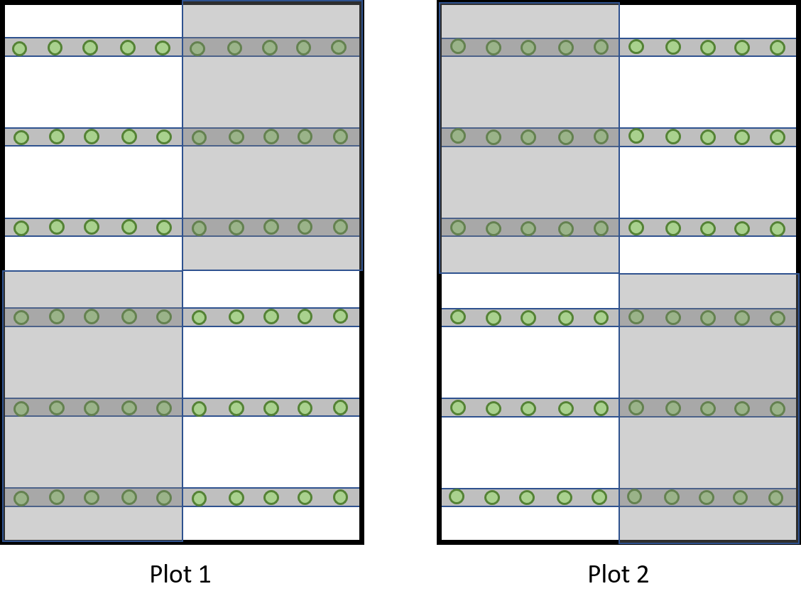

```{r setup, include=FALSE}
knitr::opts_chunk$set(echo = TRUE)
```

##ENEC 891 Final
###M. Elizabeth Moore

##Exploration of field temperature manipulation data collected Summer 2019

###Background
I conducted a field experiment at Mason Farm Biological Reserve in the summer of 2019 to investigate the effects of natural and manipulated field temperatures on the growth, development and survival of the Lepidoptera *Manduca sexta* and its hymenopteran parasitoid, *Cotesia congregata*. In laboratory conditions, *C. congregata* has been shown to have lower thermal tolerance and greater thermal sensitivity than its caterpillar host. The goal of this experiment was to see if similar trends exist in field conditions. 

###Experimental design:
Two field plots were established (12m x 10m each) in the experimental area of Mason Farm. Each plot consisted of 6 rows of 10 tobacco plants, for a total of 120 plants across both plots. Plants were grown in the greenhouse at UNC and transferred to Mason Farm between 7-8 weeks after germination. Plants in plot 1 were planted in the ground 12-16 days after being transferred to the field site, and plot 2 plants 26-31 days after. The field plots were covered in weed barrier before planting. Half of the area was covered with black weed barrier, to increase the temperature by collecting radiative solar energy and releasing it back onto the plants. The other half was covered with grey weed barrier to serve as a control. Black and grey weed barrier treatments were set up in a block design, and the order of the blocks was reversed between plot 1 and plot 2 (see image below).



The experimental design consisted of a 2x2 factorial design, with two parasitization treatments (NP and P) and two weed barrier treatments (black and grey). Caterpillars were reared in the lab at 25+/-10 from hatching to the 3rd instar on fresh tobacco leaves. At the 3rd instar, they were massed and assigned to a parasitization and weed barrier treatment, and assigned to a specific plant in one of the plots. Each plant was assigned two caterpillars, in either a NP, P or P, P combination. 


